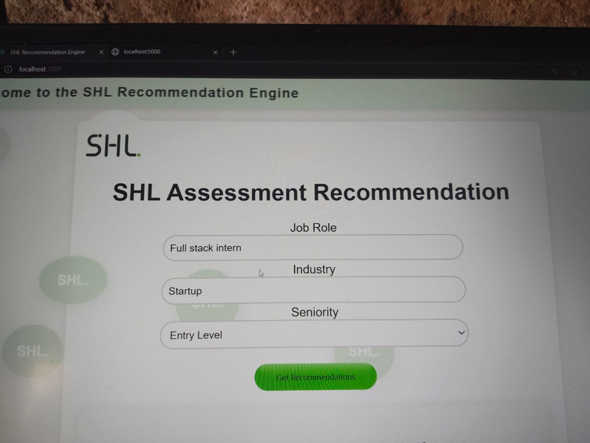
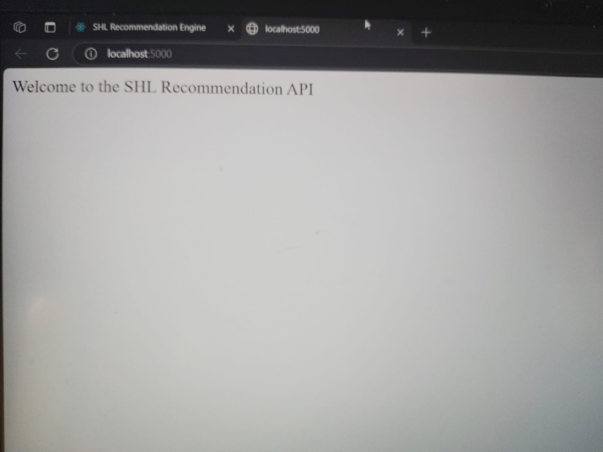
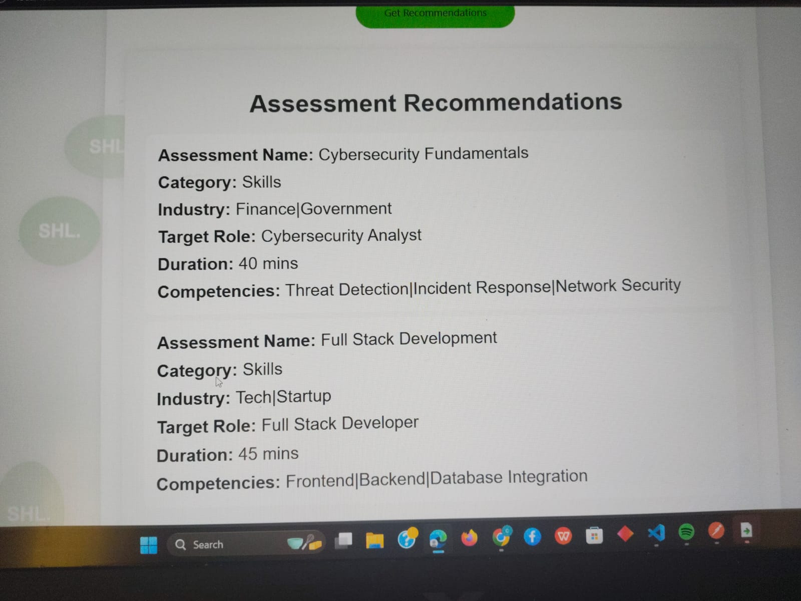
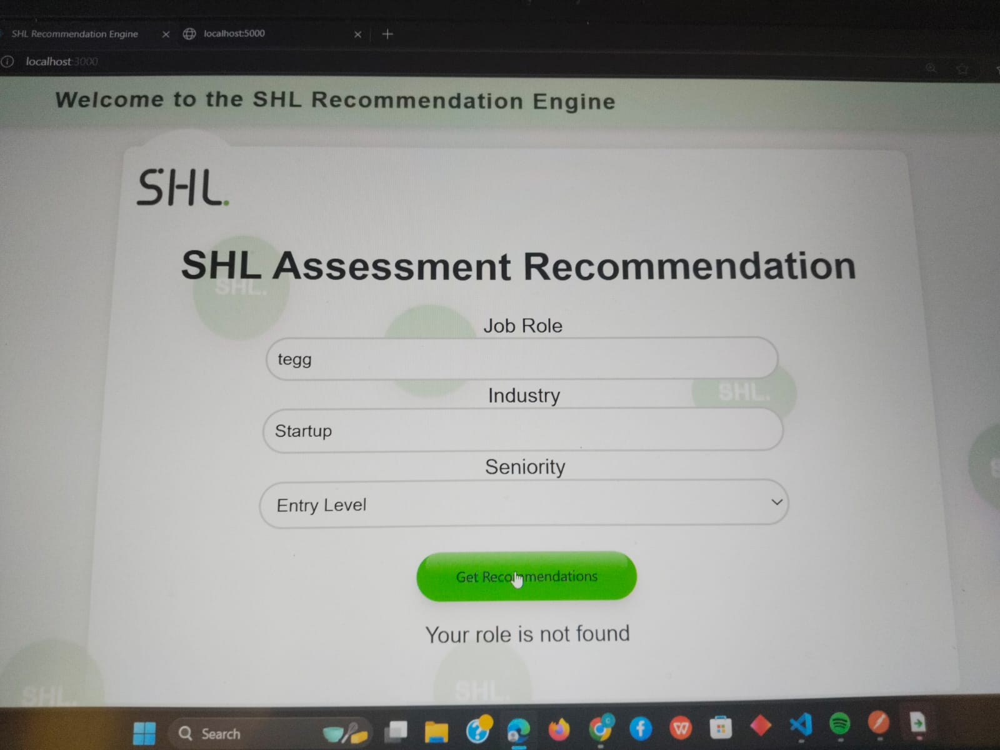

Here's a README file you can use for your SHL Assessment Recommendation Engine:

# SHL Assessment Recommendation Engine

This project provides a recommendation engine for SHL assessments based on job roles, industries, and seniority. It uses machine learning techniques such as cosine similarity and natural language processing (NLP) to match and recommend the most relevant assessments to users.

## Table of Contents

1. [Project Overview](#project-overview)
3. [Tech Stack](#tech-stack)
4. [Setup Instructions](#setup-instructions)
5. [API Usage](#api-usage)
6. [Data Seeding](#data-seeding)
7. [Output](#output)
### Screenshots







## Project Overview

The SHL Assessment Recommendation Engine is designed to match job roles with the most relevant assessments using a variety of factors, such as:

- **Job Role**: The desired job position of the user.
- **Industry**: The industry to which the user belongs.
- **Seniority**: The seniority level of the user (e.g., Entry, Mid, Senior).

The engine uses `natural`, a natural language processing library, and `compute-cosine-similarity` for calculating the similarity between job roles and assessment data.

## Tech Stack

- **Backend**: Node.js, Express.js
- **Database**: MongoDB (with Mongoose ORM)
- **Libraries**: 
  - `natural` (for text processing and similarity calculation)
  - `compute-cosine-similarity` (for calculating the cosine similarity between vectors)
- **Environment**: MongoDB Atlas (cloud-based database)
- **Machine Learning**: Jaro-Winkler distance for string matching and Tf-IDF for document vectorization

## Setup Instructions

### Prerequisites

Before running the project, ensure you have the following installed:
- [Node.js](https://nodejs.org/en/) (>=12.x)
- [MongoDB Atlas Account](https://www.mongodb.com/cloud/atlas) (for cloud database)
- [Git](https://git-scm.com/)

### Steps

1. **Clone the repository**:
   ```bash
   git clone https://github.com/your-username/assessment-recommendation-engine.git
   cd assessment-recommendation-engine
Install dependencies:

npm install
Create a .env file at the root of the project and add the following content:


MONGO_URI=your-mongo-uri-here
Replace your-mongo-uri-here with the connection string provided by MongoDB Atlas.

Run the application:

npm start
This will start the Express server on http://localhost:3000.

API Usage
The engine provides an API to get assessment recommendations based on a user's input. You can send a POST request to the /recommendations endpoint with the following JSON body:

Request Body:
json

{
  "jobRole": "Software Engineer",
  "industry": "Tech",
  "seniority": "Entry"
}

Response:
If successful, you'll get a response with the best match and other top recommendations:

json

{
  "bestMatch": {
    "AssessmentID": "SHL011",
    "AssessmentName": "Verbal Reasoning",
    "Category": "Cognitive",
    "TargetRole": "Software Engineer",
    "Industry": "All",
    "UseCase": "Hiring",
    "Duration": "20 mins",
    "Competencies": "Verbal Comprehension|Logical Thinking",
    "Seniority": "Entry"
  },
  "recommendations": [
  
    // Additional recommended assessments
  ]
}
If no matching assessments are found, the response will include an error message:

json

{
  "error": "Your role is not found"
}
Example Request using curl:
bash
curl -X POST http://localhost:3000/recommendations \
  -H "Content-Type: application/json" \
  -d '{"jobRole": "Software Engineer", "industry": "Tech", "seniority": "Entry"}'
  
API cheking through postman Application:
POST http://localhost:5000/api/recommend – Get recommended assessments based on user input (send JSON body)
{
  "role": "Software Engineer",
  "experience": "2 years",
  "skills": ["JavaScript","React", "Node.js"]
}

Response:
json
{
  "recommended": [
  
    "SHL Cognitive Assessment",
    "SHL Technical Skills Test"
  ]
}
Data Seeding
To seed the database with initial assessment data, follow these steps:

Clone the repository and install the dependencies as described above.

Open the dataSeeder.js file.

Run the script to insert sample data into the MongoDB database:

bash
node dataSeeder.js
The script will connect to your MongoDB database, clear any existing data, and insert the predefined assessments.


Feel free to contribute or modify the code to suit your needs!

This README covers the essential aspects of your project, including setup instructions, API usage, and data seeding for MongoDB. You can modify the sections to match your project specifics more closely if needed. Let me know if you need further changes!
